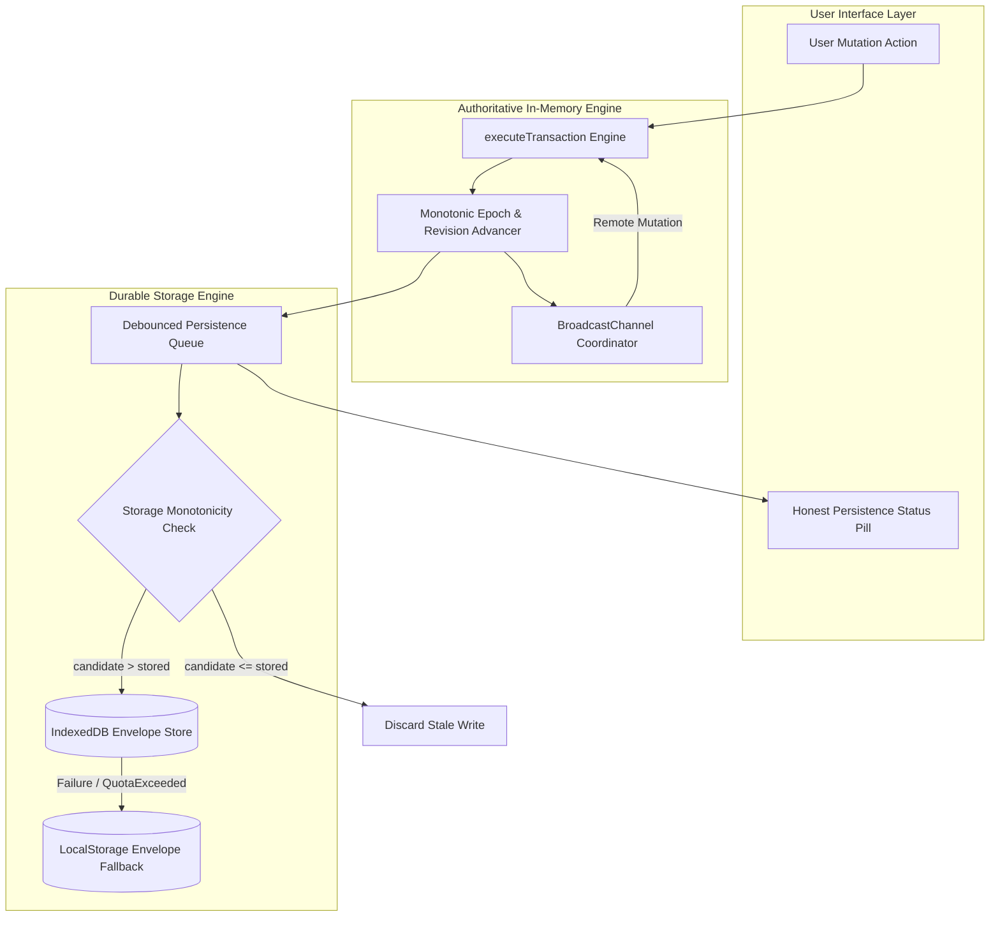

# NEXUS Failure Recovery, Asynchronous Ordering & Multi-Tab Synchronization Architecture

> **Engineering Specification & Operational Runbook — NEXUS Local-First Durability Engine**

---

## 1. System Overview & Core Invariants

NEXUS is designed as a resilient local-first SaaS application. Without reliance on remote cloud databases or centralized servers, the browser environment presents real distributed systems challenges:
* IndexedDB transactions complete asynchronously and may be delayed or reordered by the OS/browser scheduler.
* Users can interact with the DOM and dispatch mutations before asynchronous startup hydration from storage has completed.
* Multiple concurrent tabs may modify the same workspace, individual projects, or the exact same task.
* IndexedDB quota errors, transaction aborts, and database locks can occur intermittently.
* Destructive workspace resets can be resurrected if an in-flight background write from a previous workspace lifecycle lands after the reset.

To guarantee complete correctness, zero silent data loss, and predictable state transitions under all these conditions, NEXUS implements the **NEXUS Concurrency & Durability Layer**.



---

## 2. Versioning & Monotonicity Model

### 2.1 The $(\text{epoch}, \text{revision})$ Tuple
Every workspace state snapshot and storage record is identified by a two-dimensional generation-revision tuple:
1. **`epoch: number`** (starts at `1`): Generation token. It increments by $+1$ **only** upon explicit, destructive workspace resets.
2. **`revision: number`** (starts at `1`): Monotonically increasing logical counter. It increments by $+1$ upon every committed state mutation.
3. **`version?: number`** on entities (e.g. `Task.version`): Fine-grained optimistic concurrency version for individual tasks.

### 2.2 Lexicographical Ordering Rule
Comparison between any two snapshots $A$ and $B$ follows strict lexicographical precedence:

$$\text{compareVersions}(A, B) = \begin{cases}
A.\text{epoch} - B.\text{epoch} & \text{if } A.\text{epoch} \neq B.\text{epoch} \\
A.\text{revision} - B.\text{revision} & \text{if } A.\text{epoch} = B.\text{epoch}
\end{cases}$$

* $A > B \iff (A.\text{epoch} > B.\text{epoch}) \lor (A.\text{epoch} = B.\text{epoch} \land A.\text{revision} > B.\text{revision})$
* A state with a higher epoch **always** supersedes any state with a lower epoch, regardless of revision number.

### 2.3 Storage Envelopes
Neither raw un-versioned arrays nor unstructured JSON payloads are ever written to disk. Every record is encapsulated in a `PersistedEnvelope`:
```typescript
export interface PersistedEnvelope<T = WorkspaceState> {
  schemaVersion: number; // 1
  epoch: number;         // Generation epoch (e.g. 1)
  revision: number;      // Monotonic mutation revision (e.g. 42)
  savedAt: string;       // ISO 8601 timestamp
  data: T;               // Complete sanitized workspace payload
}
```

---

## 3. Startup Hydration Race Protection

### Problem Statement
When the web application loads, React mounts synchronously and renders the initial baseline workspace. An asynchronous background task immediately issues `loadUnifiedWorkspace()` to fetch persisted data from IndexedDB. If a user immediately creates, edits, or deletes a task *before* IndexedDB responds, the in-memory state advances (e.g. to revision 2). When the delayed storage response finally arrives (at revision 1), a naive application would overwrite `workspace` state with the older storage snapshot, silently deleting the user's immediate edits.

### Solution
1. **`hasLocalMutatedSinceMountRef` Guard**:
   `AppContext` maintains an un-stale synchronous ref `hasLocalMutatedSinceMountRef`. Any user mutation immediately sets this flag to `true`.
2. **Hydration Version Gating**:
   When `loadUnifiedWorkspace()` resolves:
   ```typescript
   if (hasLocalMutatedSinceMountRef.current) {
     console.warn('[NEXUS Hydration] Preserving in-memory state; local mutations occurred prior to hydration completion');
     return; // Discard older storage snapshot
   }
   if (compareVersions(persisted, workspaceRef.current) > 0) {
     setWorkspace(sanitized);
   }
   ```
3. **Automated Verification**:
   Verified in `tests/concurrency/hydrationRaces.test.ts`.

---

## 4. Out-of-Order Write Protection & Coalescing

### Problem Statement
In a multi-tab or heavy asynchronous environment, write requests to IndexedDB can be scheduled out of order by the browser runtime. For example, mutation 12 might complete quickly while a delayed mutation 10 completes 50ms later. If mutation 10 overwrites mutation 12, durable storage regresses in time, corrupting state.

### Solution
1. **Storage-Level Monotonicity Check**:
   In `idbStorage.ts`, within the transaction boundary before executing `store.put()`, the existing record is inspected:
   ```typescript
   const current = getReq.result;
   if (current && compareVersions(currentEnvelope, candidateEnvelope) > 0) {
     // Candidate is older than what is already stored on disk!
     console.warn(`[NEXUS IDB] Discarding stale write (candidate rev:${candidateEnvelope.revision} <= current rev:${currentEnvelope.revision})`);
     resolve(true); // Ignore write without regressing disk
     return;
   }
   store.put(candidateEnvelope, RECORD_KEY);
   ```
2. **Debounced Coalescing Queue**:
   Mutations are debounced (default 500ms) with in-flight write coalescing. If 100 mutations occur in rapid succession, only the latest candidate is dispatched, minimizing disk I/O while ensuring monotonicity.
3. **Automated Verification**:
   Verified in `tests/concurrency/outOfOrderWrites.test.ts`.

---

## 5. Destructive Workspace Reset & Zombie Defeat

### Problem Statement
A user triggers "Reset Demo Data" to restore the application to a clean seed state. However, a slow in-flight persistence write from the old state (e.g. revision 105) is still buffered in the event loop or IndexedDB queue. After the reset writes the clean state (revision 1), the delayed write lands and resurrects deleted tasks.

### Solution
1. **Generation Epoch Advance**:
   `createResetWorkspaceState` increments the epoch:
   ```typescript
   export function createResetWorkspaceState(baseState: WorkspaceState, freshState: Partial<WorkspaceState>): WorkspaceState {
     return {
       ...baseState,
       ...freshState,
       schemaVersion: 1,
       epoch: (baseState.epoch ?? 1) + 1, // e.g. Epoch 1 -> Epoch 2
       revision: 1,
       lastSavedAt: new Date().toISOString(),
     };
   }
   ```
2. **Zombie Rejection**:
   When the delayed in-flight write arrives, its envelope has `epoch: 1, revision: 105`. The storage monotonicity check compares:
   $$\text{compareVersions}(\text{stored: } (2, 1), \text{candidate: } (1, 105)) = 2 - 1 = +1 > 0$$
   Because the candidate epoch is lower, the write is permanently rejected. Zombie resurrection is impossible.
3. **Automated Verification**:
   Verified in `tests/concurrency/outOfOrderWrites.test.ts` and `tests/concurrency/finalAdversarialScenario.test.ts`.

---

## 6. Storage Failure Recovery & Split-Brain Elimination

### Dual-Tier Durability
1. **Tier 1 (IndexedDB Primary)**: High-capacity, asynchronous structured clone storage. Supports large workspaces (>5MB payloads).
2. **Tier 2 (LocalStorage Envelope Fallback)**: Synchronous fallback storage for when IndexedDB is unavailable, blocked by another tab, or failing.
3. **Bounded Retries with Backoff**:
   Persistence attempts retry up to 3 times with exponential backoff (50ms, 100ms, 150ms).
4. **Split-Brain Resolution**:
   On application startup, `loadUnifiedWorkspace()` fetches envelopes from **both** IndexedDB and LocalStorage:
   * If LocalStorage has a strictly newer version than IndexedDB (e.g. prior session experienced an IndexedDB lock), NEXUS adopts the LocalStorage state and **asynchronously migrates it forward into IndexedDB**.
   * If IndexedDB is newer or equal, IndexedDB is used.
5. **Real >5MB Payload Benchmark**:
   Tested with a full-scale workspace (450 projects, 9,000 tasks, 3,000 activities, 150 members) measuring 5.71 MB of serialized JSON. Write completes in ~200ms and reads back with 100% roundtrip integrity.
6. **Automated Verification**:
   Verified in `tests/concurrency/storageFailures.test.ts`.

---

## 7. Multi-Tab Synchronization & 3-Way Field Merge

### 7.1 Coordination Channel
* Primary: `BroadcastChannel('nexus_workspace_sync')`.
* Fallback: `window.addEventListener('storage')` on key `'nexus_sync_event'`.
* Self-filtering: Every tab generates a unique `tabId`. Outgoing messages include `sourceTabId`; incoming messages matching `currentTabId` are filtered out.
* Deduplication: A sliding window queue of 1,000 recently observed `mutationId`s prevents duplicate execution.

### 7.2 Fine-Grained 3-Way Task Merge
When Tab A edits a task (e.g. changes `title`) and Tab B concurrently edits the same task (e.g. changes `priority` and adds a `label`):
1. Both updates are compared against the common baseline (`mergeTaskFields(local, remote, baseline)`).
2. Non-overlapping field modifications are merged additively:
   * New Title: from Tab A.
   * New Priority: from Tab B.
   * Labels: union of both sets.
   * Subtasks & Comments: merged by unique ID.
3. If both tabs modified the **exact same scalar field** to different values (e.g. Tab A moved status to 'Review' while Tab B moved status to 'Done'), a direct conflict is flagged (`hadConflict = true`), deterministic resolution is applied (later timestamp), and the user is alerted via a persistence status indicator.

### 7.3 Automation Isolation
**Critical Rule**: Remote mutations received from another tab **do not trigger local automations**. Automations run exclusively on the originating tab where the user action occurred; the resulting state changes (including notifications and activity logs) are synchronized as data. This prevents duplicate notification spam and cascade storms across tabs.

---

## 8. Honest Persistence Status UX

Previous versions displayed static, misleading toasts such as `"Changes saved automatically"` immediately when an action was clicked, before disk writes had even been initiated.

NEXUS replaces deceitful messaging with an **Honest Persistence Status Indicator** in the Topbar:

| Status | Visual Indicator | Tooltip / Description |
| :--- | :--- | :--- |
| **`saved`** | Green dot | "All changes saved to persistent storage" |
| **`saving`** | Pulsing cyan dot | "Saving changes to persistent storage..." |
| **`error`** | Red dot + "Retry" link | "Failed to save changes. Click retry." |
| **`remote_update`**| Pulsing indigo dot | "Synchronized changes from another tab" |
| **`conflict`** | Amber dot | "Concurrent edits detected and merged" |

Toasts now accurately communicate UI intent (e.g. `"Task updated"`) rather than making unverified claims about persistent storage.
